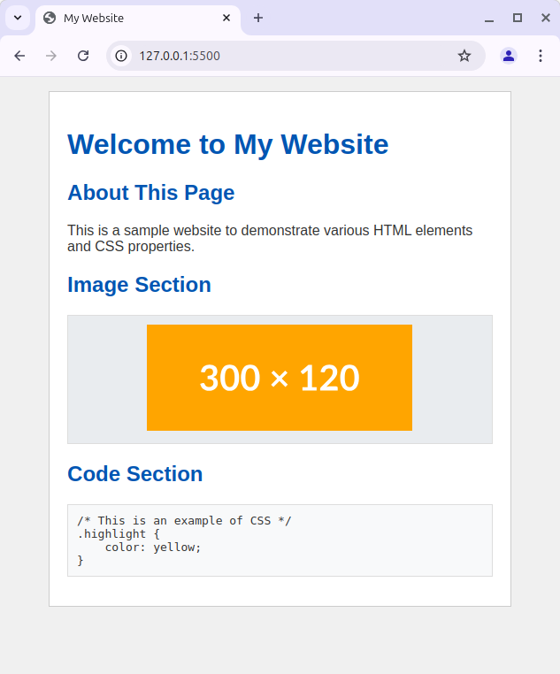

# Aufgabe 05 - HTML und CSS

## Übung 1

Erstelle eine neue HTML-Seite. Füge eine Überschrift mit dem Text "Hello, World!" und einen Absatz mit dem Text "This is a simple HTML page." hinzu. Füge einen Link zur [Wikipedia-Seite für HTML](https://en.wikipedia.org/wiki/HTML) mit dem Text "Learn more about HTML" hinzu.

Füge einen neuen Abschnitt hinzu, der eine Überschrift zweiter Ebene mit dem Text "My Favourite Websites" und eine ungeordnete Liste deiner Lieblingswebseiten enthält. Füge zu jeder Webseite einen Link hinzu.

Füge einen neuen Abschnitt hinzu, der eine Überschrift zweiter Ebene mit dem Text "My Favourite Movies" und eine geordnete Liste deiner Lieblingsfilme enthält.

Füge einen neuen Abschnitt mit folgender Struktur hinzu:

- section
    - h2
        - "About me"
    - p
        - "My name is ..."
    - p
        - "I am a student at ..."
    - p
        - "I am learning to code because ..."
    - p
        - em
            - "Your name here"

Füge schließlich ein animiertes Bild zur Seite hinzu.

## Übung 2

Erstelle eine HTML-Seite mit dem Standard HTML5-Boilerplate. Füge eine Überschrift mit dem Text "CSS Exercise" hinzu. Verwende eine externe CSS-Datei, um die Webseite im folgenden Screenshot so genau wie möglich nachzubilden:

Achte auf die Farben und den Abstand der Elemente. Beachte auch die Adresse und den Text, der im Tab-Titel angezeigt wird. Das Bild auf der Seite ist ein Platzhalter von https://placehold.co
